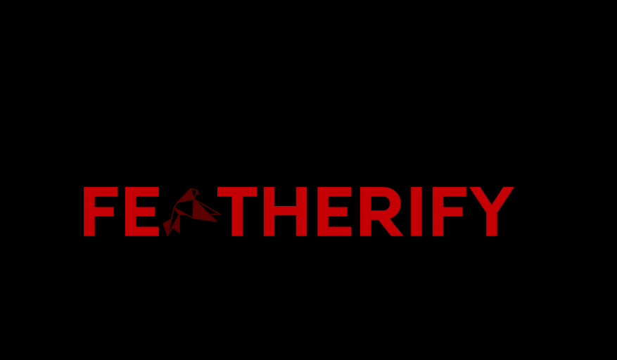

Featherify is an extremely fast and highly customizable generator of your **high-quality image**. If you don't like to _compress_ or _minify_ your image in your apps, Featherify might just be thing you were looking for.

Featherify offers two interfaces for you to generate a substitute for your image.

- The webapp _(image above)_ which has a cool looking interface for you to generate _feathers_(aka. image substitute) for your image in the browser or webapp itself.

Check it out here -> _(Hosted on AWS Amplify)_

- The API which you can use to convert your images during your _build time_ of your application.

Check it out the Documentation Here ->

_(Hosted on AWS Lamda)_

## 🚀&nbsp; Installation and Developing Locally

If you have [Python](https://www.python.org/) and [NodeJS](https://nodejs.org/en/) installed in your system, you are ready to featherify in you computer.

To Setup the Python Server, please [click here](https://github.com/aditya-mitra/featherify/tree/main/server#quickstart)

To Setup the NodeJS Client, please [click here](https://github.com/aditya-mitra/featherify/tree/main/client#quickstart)

## 🤝&nbsp; Found a bug? Missing a specific feature?

Feel free to **file a new issue** with a respective title and description on the [Issues Page](https://github.com/aditya-mitra/featherify/issues) repository.

I would love to work to extend featherify to the next limit. Please feel free to submit a pull request if you already have a good idea in mind.

## 📘&nbsp; License

Featherify is released under the terms of the [MIT License](LICENSE).
